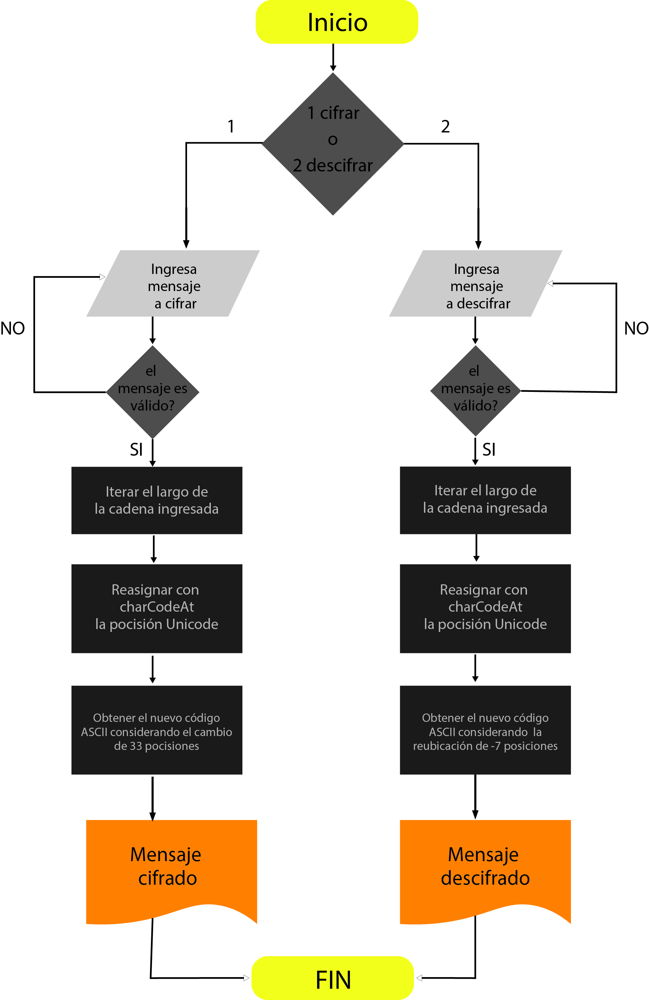

#Read me
En esta mini-aplicación, vamos a aplicar el algoritmo de Cifrado de Caesar para cifrar y descifrar mensajes ingresados por el usuario a través de un prompt.

#Reglas
El programa es capaz de cifrar y descifrar mensajes que contengan letras mayúsculas y letras minúsculas.
El usuario no puede ingresar campos vacíos.
El mensaje no debe contener números.

#Pseudocódigo de la solución propuesta

Prompt solicitando elegir una opción tecleando: 1 o 2
	Si es 1 entonces:
		Mostrar otro prompt solicitando un mensaje para cifrar
        Verificar si la cadena ingresada es válida con un mensajeValido
    	y si el mensajeValido es TRUE invocar a la función cipher()
	Si es 1 entonces:
		Mostrar otro prompt solicitando un mensaje a descifrar
        Verificar si la cadena ingresada es válida con un mensajeValido
		y si mensajeValido() es TRUE invocar a la función decipher()
  	else si el usuario ingresa algo diferente a 1 o 2, le vuelve a pedir una opción válida.

1 cipher
    Declarar una variable vacia mensajeCifrado
    Declarar una variable en cero posicionUnicode
    checar con for el largo de la cadena ingresada
        Reasignar con charCodeAt la posicion unicode de la palabra actual.
        Reasignar la posición unicode para obtener el nuevo código ASCII considerando el cambio de 33 posiciones en el alfabeto.
        Concatenar a mensajeCifrado el nuevo caracter cifrado
    MOSTRAR con alert el valor mensajeCifrado

2 descipher
    Declarar una variable vacia mensajeDescifrado
    Declarar una variable en cero posicionUnicode
    ITERAR en FOR el largo de la cadena ingresada
        Reasignar con charCodeAt la posicion unicode de la palabra actual.
        Reasignar la posición unicode para obtener el nuevo código ASCII considerando la reubicación de -7 posiciones.
        Concatenar a mensajeDescifrado el nuevo caracter desccifrado
    MOSTRAR con alert el valor mensajeDescifrado

